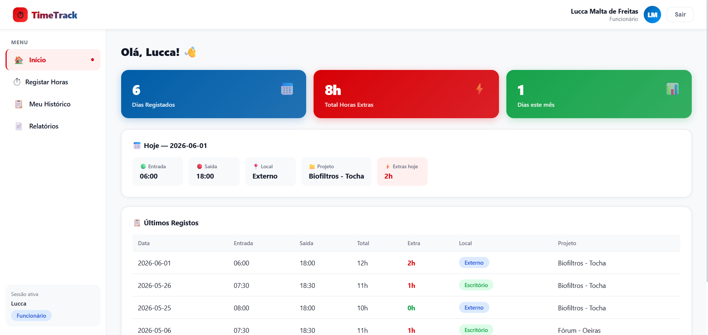

# Ponto Pronto ⏱

> An extensionist project developed as part of a college curriculum, built to solve a real workplace need: tracking employee work hours, overtime calculations, and project/location assignments in a simple and transparent way.



---

## 📋 About the Project

**Ponto Pronto** is a web application designed for small teams that work across multiple locations — including external job sites. It allows employees to log their own working hours autonomously, while giving managers a clear and organized overview of hours worked, overtime, and project assignments.

The application was built based on the real needs of a company with field employees, where tracking overtime and work locations was previously done manually.

---

## ✨ Features

- 🔐 Role-based authentication — **Admin** and **Employee** profiles
- ⏱ Clock-in / clock-out with project and location selection
- 📍 Location tracking — **Office (Oficina)** or **External site**
- ⚡ Automatic overtime detection — any time outside **08:00–18:00** is flagged
- 📊 Admin dashboard with per-employee summary
- 📋 Full records history with filtering by employee
- 🏗 Project management — create, edit, archive and delete
- 👥 Employee management panel
- 📄 Monthly PDF reports with normal vs. overtime breakdown

---

## 🛠 Tech Stack

| Layer | Technology |
|---|---|
| Frontend | React.js |
| Database | Firebase Firestore |
| Authentication | Firebase Authentication |
| Hosting | Firebase Hosting |
| Styling | Inline styles + CSS animations |

---

## 🚀 Getting Started

### Prerequisites
- Node.js v18+
- npm v9+
- A Firebase project

### Installation

```bash
# Clone the repository
git clone https://github.com/your-username/ponto-pronto.git

# Navigate into the project
cd ponto-pronto

# Install dependencies
npm install
```

### Firebase Setup

1. Create a project at [firebase.google.com](https://firebase.google.com)
2. Enable **Authentication** (Email/Password)
3. Create a **Firestore** database
4. Register a web app and copy the config

Create the file `src/firebase.js`:

```js
import { initializeApp } from "firebase/app";
import { getAuth } from "firebase/auth";
import { getFirestore } from "firebase/firestore";

const firebaseConfig = {
  apiKey: "YOUR_API_KEY",
  authDomain: "YOUR_AUTH_DOMAIN",
  projectId: "YOUR_PROJECT_ID",
  storageBucket: "YOUR_STORAGE_BUCKET",
  messagingSenderId: "YOUR_MESSAGING_SENDER_ID",
  appId: "YOUR_APP_ID"
};

const app = initializeApp(firebaseConfig);
export const auth = getAuth(app);
export const db = getFirestore(app);
```

### Running Locally

```bash
npm start
```

App will be available at `http://localhost:3000`

---

## 🌐 Live Demo

<!-- Add your live URL here after deployment -->
> 🔗 Coming soon

---

## 🗄️ Firestore Structure

```
firestore/
├── users/{uid}
│   ├── name: string
│   ├── email: string
│   └── role: "admin" | "employee"
│
├── projects/{projectId}
│   ├── name: string
│   └── status: "active" | "archived"
│
└── records/{recordId}
    ├── userId: string
    ├── date: string (YYYY-MM-DD)
    ├── entry: string (HH:MM)
    ├── exit: string (HH:MM)
    ├── location: "office" | "external"
    ├── projectId: string
    └── notes: string
```

---

## 📦 Deployment

```bash
# Build the app
npm run build

# Initialize Firebase Hosting (first time only)
firebase init hosting
# → Public directory: build
# → Single-page app: Yes
# → Overwrite index.html: No

# Deploy
firebase deploy --only hosting
```

---

## 🔒 Firestore Security Rules

```
rules_version = '2';
service cloud.firestore {
  match /databases/{database}/documents {
    match /records/{recordId} {
      allow read, write: if request.auth != null
        && request.auth.uid == resource.data.userId;
      allow read: if request.auth != null
        && get(/databases/$(database)/documents/users/$(request.auth.uid)).data.role == 'admin';
    }
    match /projects/{projectId} {
      allow read: if request.auth != null;
      allow write: if request.auth != null
        && get(/databases/$(database)/documents/users/$(request.auth.uid)).data.role == 'admin';
    }
    match /users/{userId} {
      allow read, write: if request.auth != null && request.auth.uid == userId;
      allow read, write: if request.auth != null
        && get(/databases/$(database)/documents/users/$(request.auth.uid)).data.role == 'admin';
    }
  }
}
```


---

## 👨‍💻 Author

Developed by **Lucca** as an extensionist college project.

---

## 📄 License

This project is for academic and personal use.